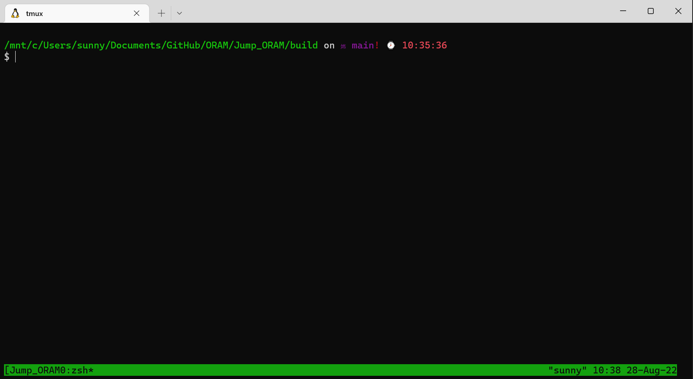
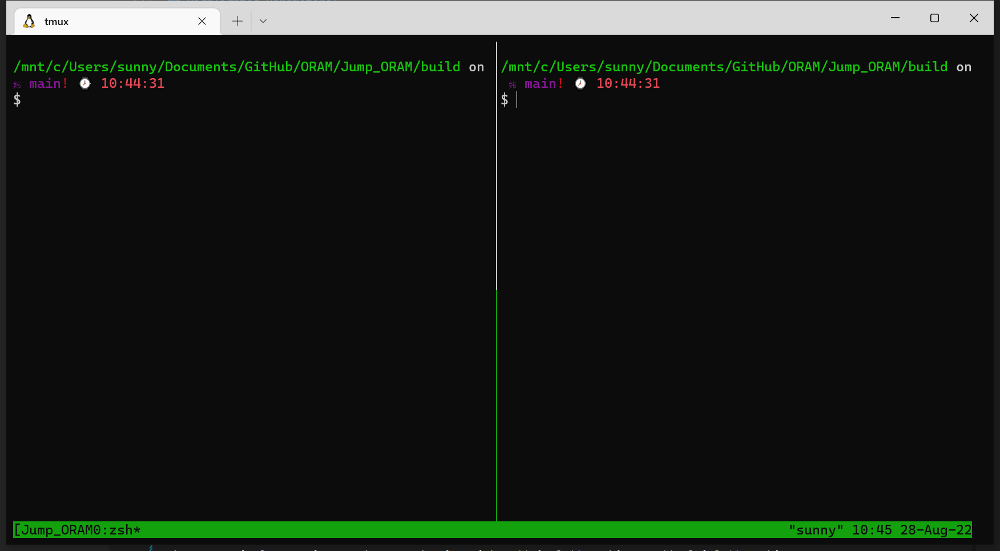
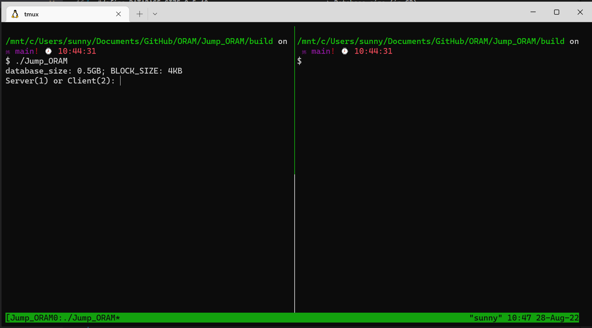
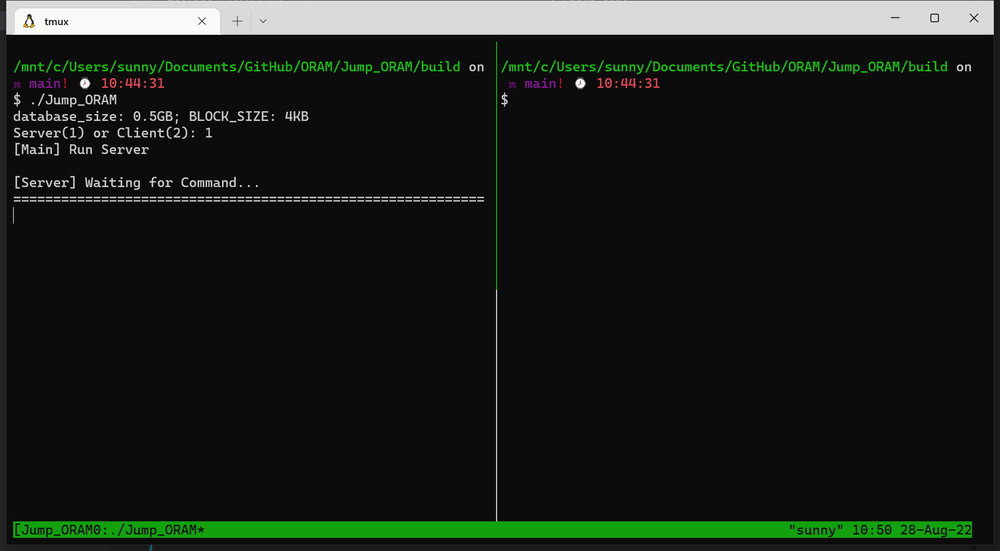
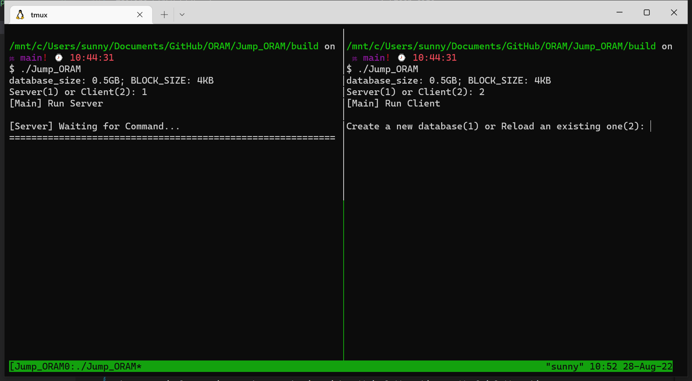
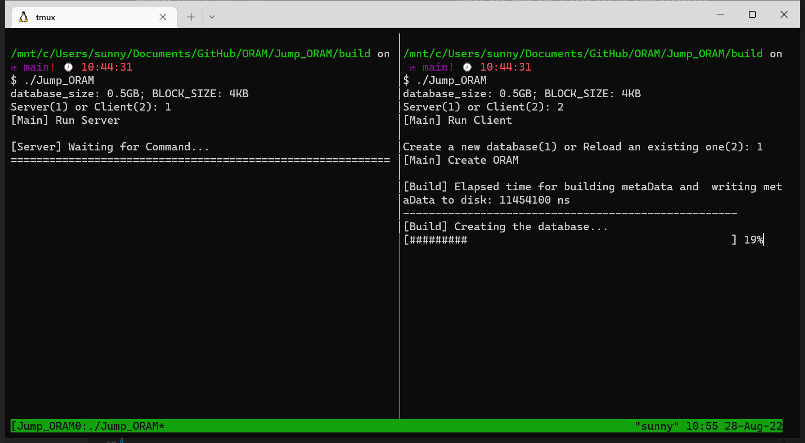
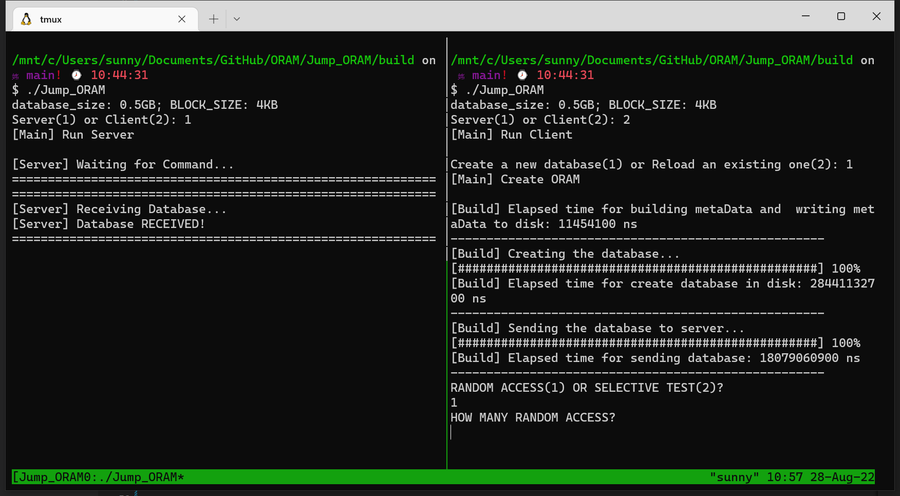
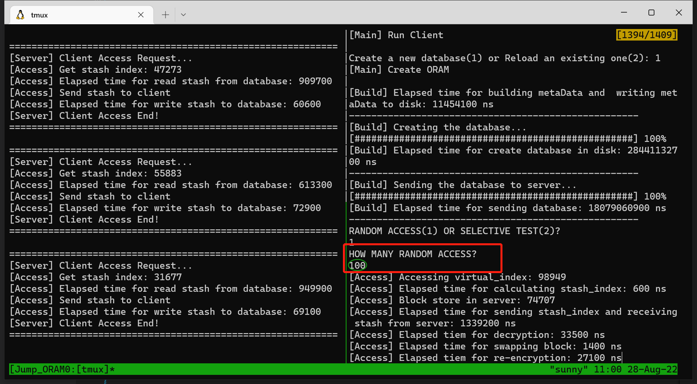

# Jump-ORAM 
The implementation of Jump-ORAM, the paper of which was submitted to INFOCOM. 
We programmed this project on [VS code](https://code.visualstudio.com/) and  ran it on Ubuntu20.04 with g++ as compiler. 
It is recommended to use the editor and running environment mentioned above. 

# Required Libraries
[libtomcrypt](https://github.com/libtom/libtomcrypt)

# Configuration
All Jump-ORAM configurations are located in ```Jump_ORAM/src/config.h```. 

## Highlighted Parameters:
```
#define BLOCK_SIZE 4-1024                                -> Block size (in KB)

#define DATABASE_SIZE 0.5-40                             -> Database size (in GB)

#define STASH_SIZE  2                                    -> Stash size

#define CACHE_SIZE  2                                    -> Data Cache size

const std::string SERVER_ADDR[NUM_SERVERS]               -> Server IP addresses
#define SERVER_PORT 5210                                 -> Define the port for client-server communications

```
# Build & Compile
Goto folder ``Jump_ORAM/`` and execute
``` 
mkdir build
cd build
cmake .. 
make
```

, which produces the binary executable file named ```Jump_ORAM``` in ``Jump_ORAM/build/``.

# Usage

Run the binary executable file ```Jump_ORAM```, which will ask for either Client or Server mode. To make it easier to see
the interactive process between the client and server, we used the **tmux** window tool to present the usage of binary executable file.
> ```tmux new -s Jump_ORAM```

> short cut: ```Ctrl+b, %``` (to achieve the split screen left and right)

> ```./Jump_ORAM``` on the left side first.

> select $1$ to execute the server first

> ```./Jump_ORAM``` on the right side and select $2$ to execute the client.

> Choose $1$ to create a new database owing to your first run this program. And next time, you can choose $2$ to connect to the existing database.

> Now, you will face another choices to choose $1$ or $2$ to randomly or sequentially access a data block in the database.
> For example you can choose $1$ to randomly access a data block in the database.

> Then you face a question:How many times of your random access? You can choose an integer you like.

```

# Further Information
For any inquiries, bugs, and assistance on building and running the code, please contact me at changqischolar@gmail.com.
